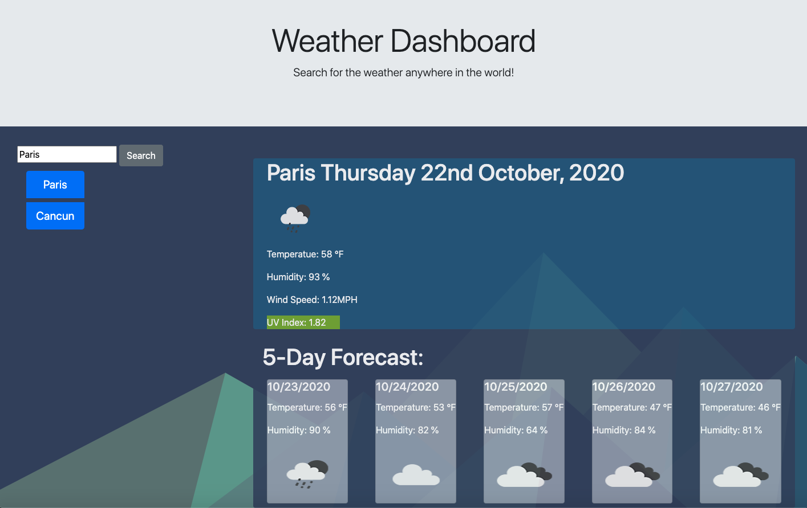

# weather_dashboard

[Weather Dashboard](https://israelguillermo.github.io/weather_dashboard/)

Weather Dashboard is an application which allows you to see the weather anywhere in the world! This application gives you the current weather, wind speed, humidity and UV index! The application also generates a 5 day forecast based on the city searched. Once a city is searched, a button is created and saved for user convenience. 

